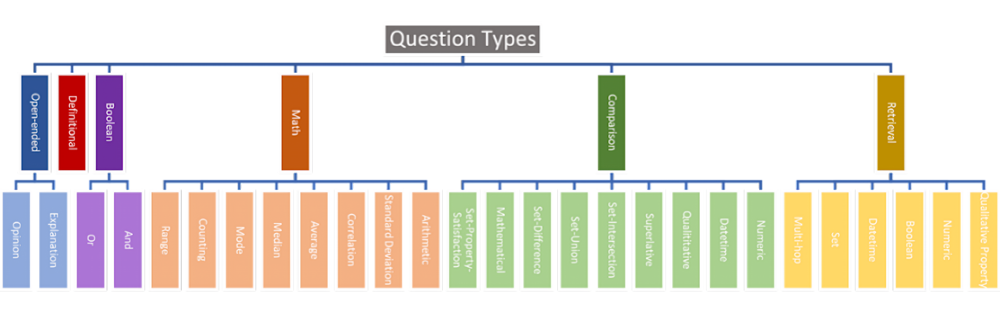
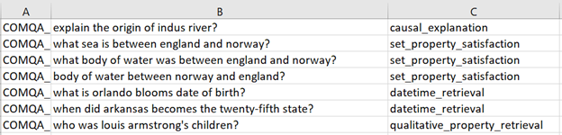
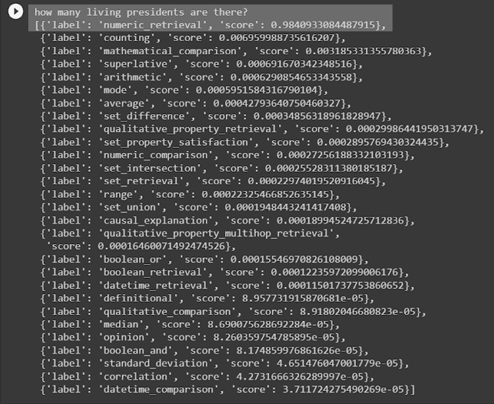

# Fine-tuning BERT for Classifying Question Types
We hand-label a dataset of about 850 example questions based on our taxonomy of 27 question types, then finetune DistilBERT for classification.  
  
The resulting classifier achieved an accuracy of 0.806 on the test set, but this should not be taken at face value since the original dataset was unbalanced and quite small.
  
## Taxonomy:  
  

## Dataset:  
  
  
## Example Output:  
  
